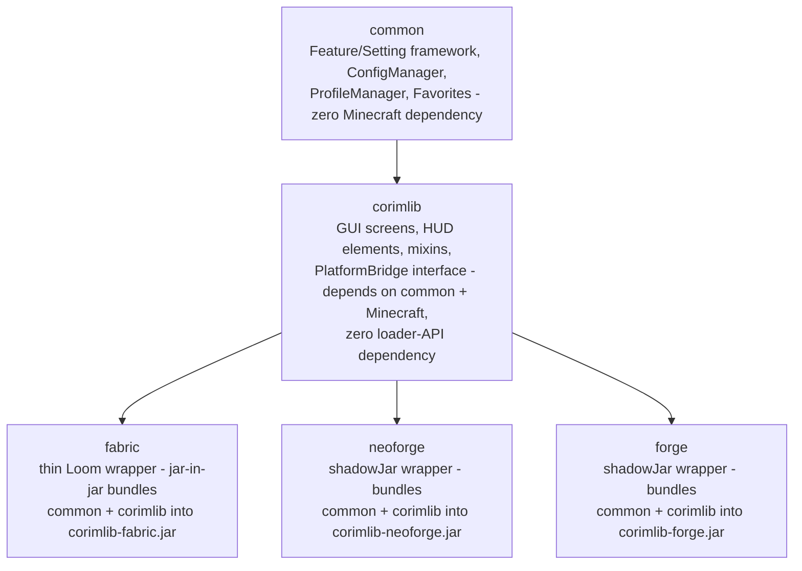

# Architecture Overview

## Module layout

CorimLib is a Gradle multi-module project with two loader-agnostic layers and three thin loader wrappers:



- **`common`** — the loader-agnostic core: `Feature`/`Setting`/`FeatureRegistry`/`Category`, JSON config (`ConfigManager`), profiles (`ProfileManager`), and `Favorites`. No Minecraft dependency at all — this module would compile against nothing but the JDK and Gson.
- **`corimlib`** — loader-agnostic *Minecraft-dependent* code: GUI screens, HUD rendering, mixins, and the `PlatformBridge` interface itself. Depends on `common` and Minecraft, but has zero dependency on any loader's API (no Fabric API, no NeoForge/Forge event classes).
- **`fabric` / `neoforge` / `forge`** — each is a thin wrapper with (mostly) no source of its own. Their only job is bundling `common` + `corimlib` into one standalone, self-contained mod jar (`corimlib-fabric`, `corimlib-neoforge`, `corimlib-forge`) that a dependent mod can install alongside itself. `neoforge`/`forge` additionally need a trivial no-op `@Mod` entrypoint class, since neither loader allows a mod with zero entrypoints the way Fabric does.

This is *not* the same shape as a mod that consumes CorimLib. A dependent mod has its own `fabric`/`neoforge`/`forge` modules containing the actual `PlatformBridge` *implementations* (e.g. `FabricPlatformBridge`, `NeoForgePlatformBridge`, `ForgePlatformBridge`) — those live in the consuming mod's own repo, not in CorimLib itself. See [PlatformBridge API](platform-bridge.md).

## Why no Architectury / no bytecode remapping

Minecraft 26.2 (CorimLib's baseline) uses official Mojang mappings with **no per-loader intermediary layer**. That means the exact same compiled class shapes — `GuiGraphicsExtractor`, `Screen`, `KeyMapping`, `Identifier`, etc. — are correct whether compiled against Fabric's, NeoForge's, or Forge's copy of the game jar. So `corimlib`'s GUI/HUD/mixin/feature code needs **zero per-loader source variants** to compile — only the handful of registration calls that differ (keybind registration, event bus wiring, HUD-layer registration) need loader-specific code, and those are exactly what `PlatformBridge` exists to isolate.

This is the whole reason CorimLib can be "one `corimlib` module compiled once, three thin bundling wrappers" instead of needing Architectury Loom's `@ExpectPlatform`/bytecode-remapping toolchain to produce per-loader variants of shared code.

## The `ServiceLoader` indirection

Shared code in `corimlib` never imports a Fabric/NeoForge/Forge class directly. Instead it calls:

```java
Corim.bridge().registerKeybind(myKeyMapping);
```

`Corim.bridge()` resolves to whichever `PlatformBridge` implementation is present on the classpath, found via `java.util.ServiceLoader` reading `META-INF/services/dev.py54.corimlib.PlatformBridge`. Each loader module ships exactly one implementation and exactly one service-registration file. See [PlatformBridge API](platform-bridge.md) for the full mechanism, including a real limitation of this design worth knowing about before you rely on it — [Limitations](../reference/limitations.md#single-global-platformbridge-singleton).

## Multi-version support

The 26.1.x/26.2 Minecraft line shares one API surface almost entirely — verified by actually decompiling and building against each version's real mapped jar, not assumed. The one confirmed difference across the whole line is a class rename (`Gui` → `Hud`, affecting one internal mixin target), handled with a version-specific source directory keyed by the Minecraft `MAJOR.MINOR` generation (`src/version/26.1/java`, `src/version/26.2/java`) rather than per-patch, so `corimlib`'s public API is identical everywhere it's supported. See [Supported Versions & Loaders](../reference/supported-versions.md) for exactly which loader/version combinations actually have a build.
